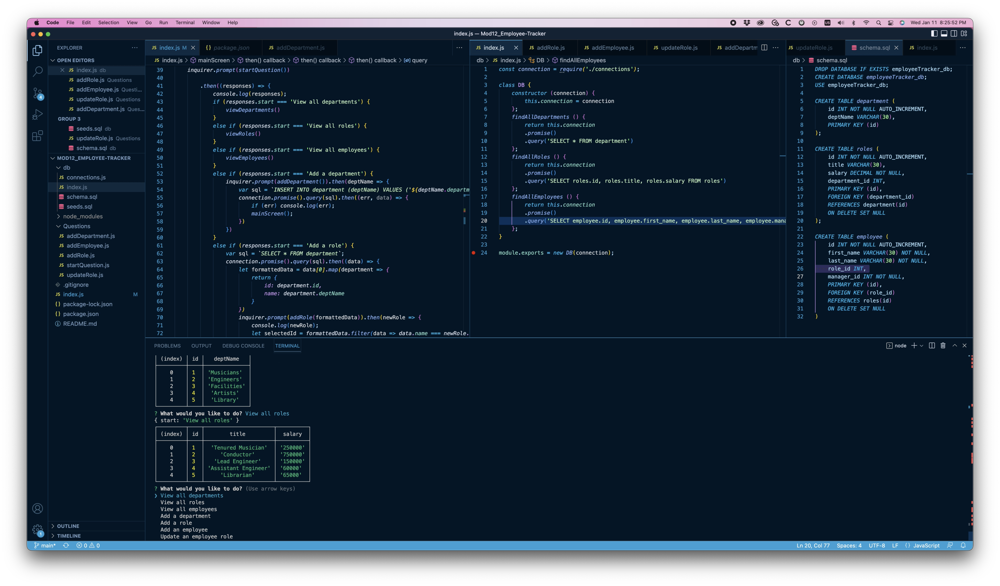

# Employee Tracker

This is an **employee tracker** that keeps track of the workers at a company.

## Table of Contents

- [Background](#background)
- [Install](#install)
- [Usage](#usage)
- [Screenshot](#screenshot)
- [Maintainers](#maintainers)
- [Contributing](#contributing)
- [Contributors](#contributors)
- [License](#license)

## Background

*To apply lessons from MySQL,* we were instructed to create a backend employee tracker to be run in the console.

## Install/Link to Video Walkthrough 🔗 

Check out the link to the video walkthrough:

https://youtu.be/m6cLBysRXn4

## Usage

This is being used as an assignment project, but could easily be used as a starting point for a real life employee tracker.

## Screenshot

## Maintainers

[@Danny Bedrossian](https://github.com/dbedrossian).

## Contributing

Feel free to dive in! [Open an issue](https://github.com/dbedrossian/standard-readme/issues/new) or submit PRs.

## Contributors

Thanks to 5 tutors and online assistants for help on this.

## License

Open